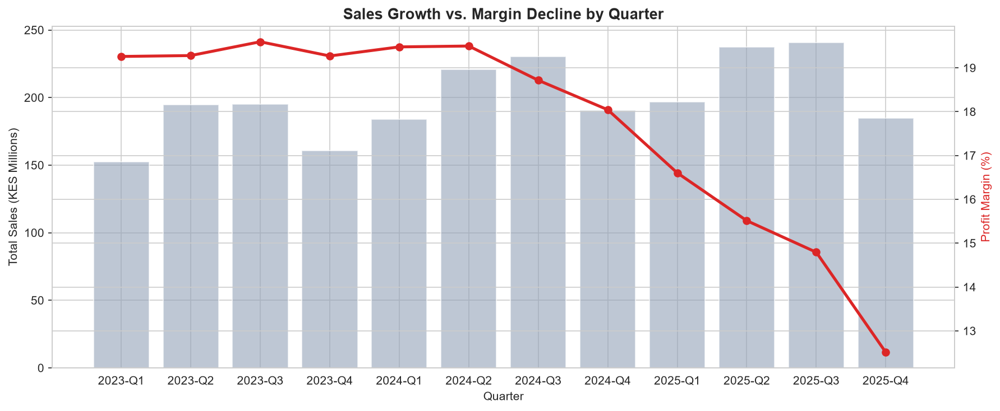
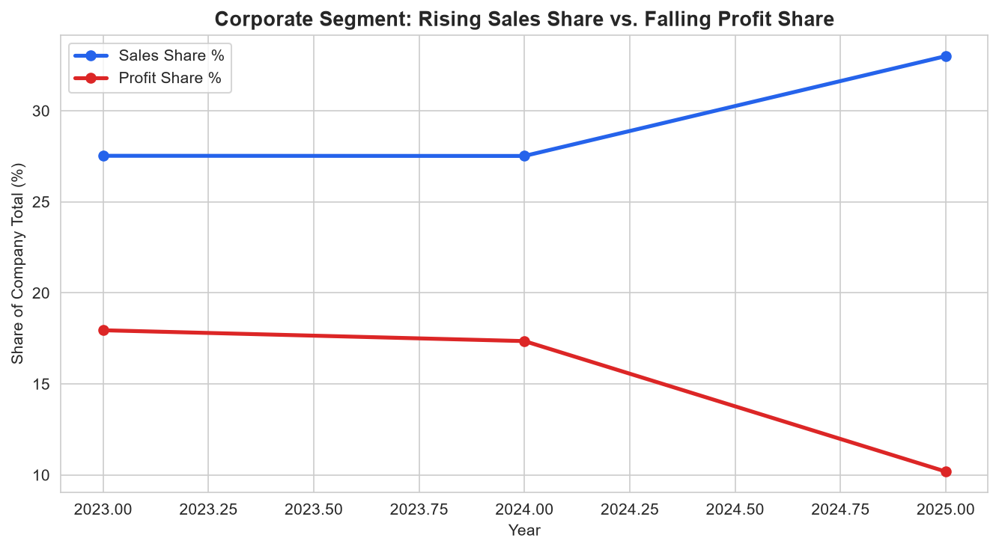
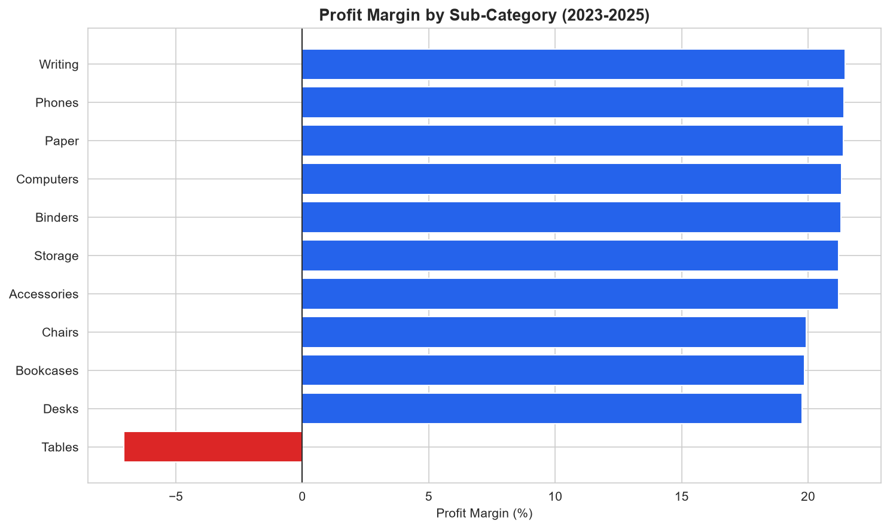
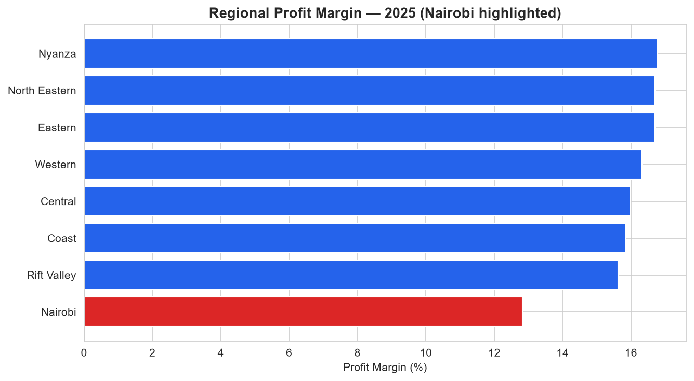
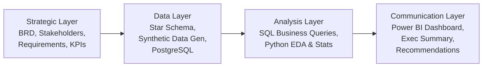
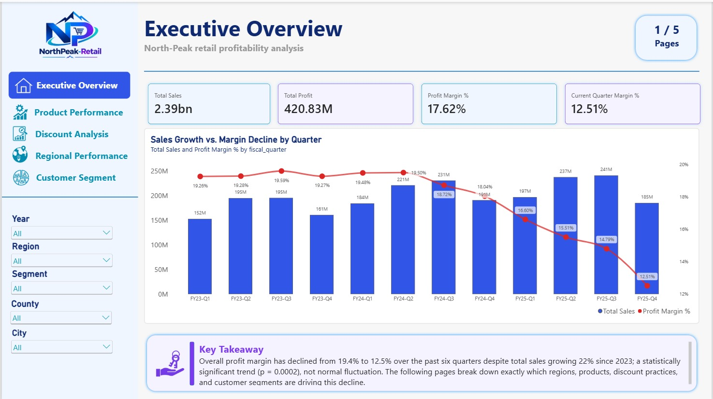
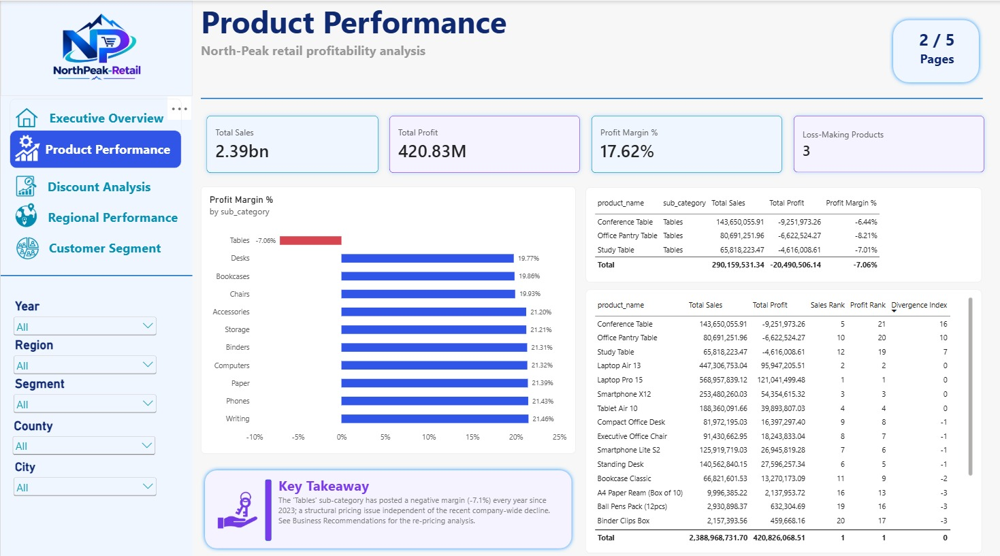
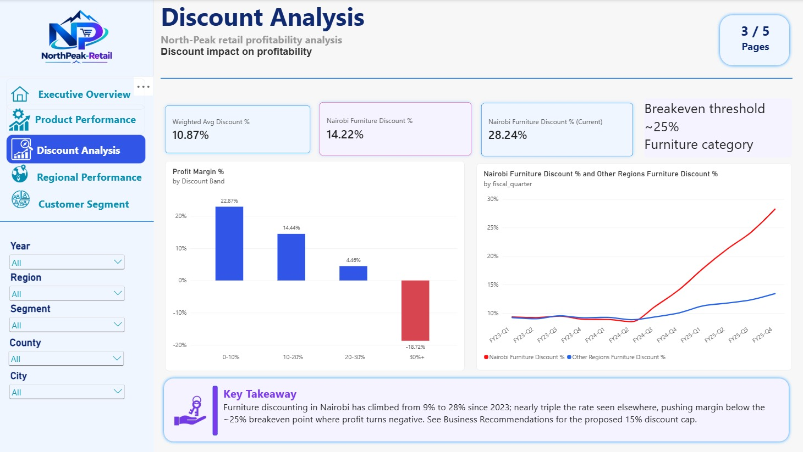
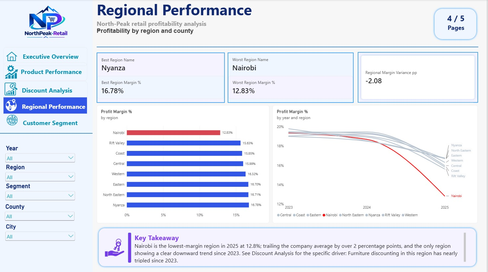
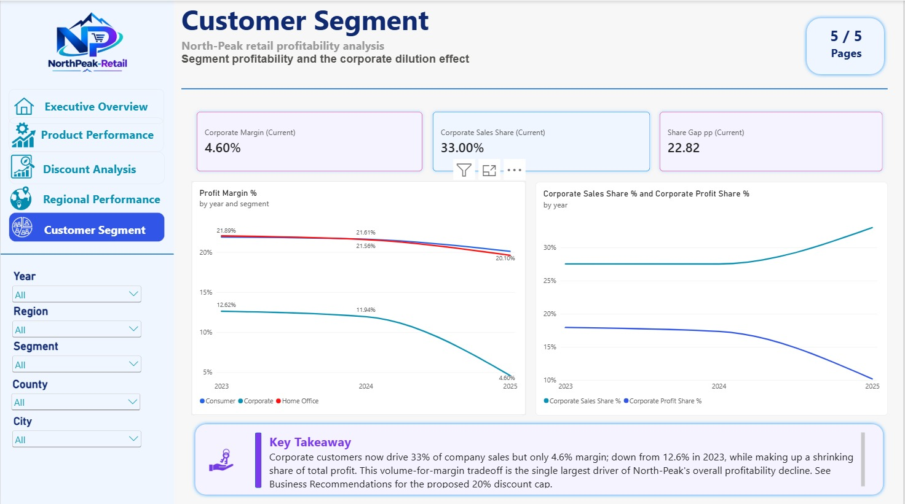

# NorthPeak Retail - Profitability Decline Analysis

**An end-to-end Business Analyst / Data Analyst portfolio project diagnosing why a retailer's profit margin declined from ~19% to ~12.5% despite 22% sales growth, and quantifying exactly what to do about it.**

---

## Business Problem

NorthPeak Retail Group (Kenya-based retailer) grew sales 22% over three years, but profit margin fell from ~19% (2023) to ~12.5% (2025). Leadership had no unified view connecting sales, discounting, product, region, and customer segment data to explain *why* revenue growth wasn't translating into profit growth.

This project answers that question end-to-end: business requirements → data modeling → SQL analysis → statistical validation in Python → an interactive Power BI dashboard → quantified, prioritized recommendations.

**Full business context:** [`docs/BRD.md`](docs/BRD.md)

---

## Key Findings

Three specific, statistically validated root causes explain the decline:

| Finding | Evidence |
|---|---|
| **Corporate segment margin collapse** | Corporate's share of sales grew 27.5% → 33.0%, while its margin collapsed 12.6% → 4.6%, a classic volume-for-margin dilution pattern, confirmed via Welch's t-test (p < 0.000001) |
| **Discount creep in Nairobi Furniture sales** | Discount rose from ~9% to ~28% in 18 months — nearly triple the rate seen in any other region for the same category |
| **"Tables" sub-category structurally unprofitable** | Negative margin every year since 2023 (-7.1% overall), independent of the broader decline, a pricing/cost issue, not a discounting issue |

The overall margin decline itself is statistically significant (linear regression: -0.57 percentage points/quarter, p = 0.0002, R² = 0.76), not normal quarter-to-quarter noise.

<p align="center">
  
  
</p>
<p align="center">
  
  
</p>

**Full findings:** [`reports/executive_summary.md`](reports/executive_summary.md) · **Full recommendations with quantified impact:** [`reports/business_recommendations.md`](reports/business_recommendations.md)

---

## Recommendations & Estimated Impact

| Recommendation | Estimated Annual Recovery (KES) |
|---|---|
| Cap Corporate segment discount at 20% | 15,041,012 |
| Cap Nairobi Furniture discount at 15% | 10,924,092 |
| Re-price "Tables" to category-average margin | 34,779,370 |
| **Total (directional, upper-bound estimate)** | **≈ 60,744,474** |

*(All estimates assume no volume response to reduced discounting, treated as an upper bound, not a guaranteed forecast. See the Business Recommendations report for the full methodology and caveats.)*

---

## Tech Stack

| Layer | Tools |
|---|---|
| Data generation | Python (pandas, NumPy, Faker) |
| Database | PostgreSQL (star schema) |
| Analysis | SQL, Python (Jupyter, pandas, SciPy, statsmodels, matplotlib, seaborn) |
| BI / Visualization | Power BI Desktop (DAX, data modeling) |
| Version control | Git / GitHub |

---

## Project Architecture



The dataset is **synthetically generated**, see [`internal/ground_truth.md`](internal/ground_truth.md) *(not published, internal validation reference only)* for the exact mechanisms planted, which the analysis independently rediscovers.

---

## Data Model

A proper star schema, not a single flat table — `fact_sales` (69,735 rows, one row per order line item) joined to four dimensions (`dim_date`, `dim_customer`, `dim_product`, `dim_region`), including a role-playing date dimension (order date / ship date) and Kenya-accurate geography (8 former provinces → 47 counties).

**Full design rationale:** [`docs/data_model.md`](docs/data_model.md) · **Schema DDL:** [`sql/00_schema_ddl.sql`](sql/00_schema_ddl.sql)

---

## Dashboard Preview

<p align="center">
  <br>
  <em>Executive Overview — company-wide KPIs and the core margin decline trend</em>
</p>

<p align="center">
  <br>
  <em>Product Performance — sub-category profitability, loss-making products, revenue-profit divergence</em>
</p>

<p align="center">
  <br>
  <em>Discount Analysis — discount-band profitability and the Nairobi/Furniture discount-creep trend</em>
</p>

<p align="center">
  <br>
  <em>Regional Performance — regional margin comparison, Nairobi highlighted</em>
</p>

<p align="center">
  <br>
  <em>Customer Segment — segment profitability and the Corporate dilution effect</em>
</p>

---

## Repository Structure

```
NorthPeak-Retail-Profitability/
├── docs/                    # BRD, stakeholder map, requirements, process maps, KPI framework, data model/dictionary
├── sql/                     # Schema DDL, business analysis queries, validation checks
├── scripts/                 # Synthetic data generation (Python)
├── notebooks/               # EDA + statistical validation (Jupyter)
├── images/                  # Charts exported from the notebook
├── reports/                 # Executive summary, business recommendations
├── powerbi/                 # Power BI dashboard (.pbix)
└── requirements.txt
```

---

## How to Reproduce

**1. Clone and install dependencies**
```bash
git clone https://github.com/Amollo1/NorthPeak-Retail-Profitability.git
cd NorthPeak-Retail-Profitability
pip install -r requirements.txt
```

**2. Set up PostgreSQL**
```bash
# In psql, as superuser:
CREATE DATABASE northpeak_retail;
CREATE ROLE northpeak_analyst WITH LOGIN PASSWORD 'your_password';
GRANT ALL PRIVILEGES ON DATABASE northpeak_retail TO northpeak_analyst;
```
Run the schema: `sql/00_schema_ddl.sql` against `northpeak_retail`.

**3. Configure environment**
```bash
cp .env.example .env
# edit .env with your real DB credentials
```

**4. Generate and load the data**
```bash
cd scripts
python generate_data.py
```

**5. Run the analysis**
- SQL: run `sql/02_business_analysis.sql` and `sql/03_validation_checks.sql` in your Postgres client
- Python: open `notebooks/retail_analysis.ipynb` and Run All

**6. Explore the dashboard**
Open `powerbi/NorthPeak_Profitability.pbix` in Power BI Desktop.

---

## Skills Demonstrated

**Business Analysis:** requirements gathering, stakeholder mapping, process mapping (As-Is/To-Be), KPI framework design, quantified business recommendations

**Data Engineering:** star schema design, PostgreSQL, synthetic data generation with engineered ground-truth scenarios, data quality validation

**Analysis:** SQL (CTEs, window functions, weighted aggregations), Python (pandas, statistical hypothesis testing, regression, correlation), cross-tool result validation

**BI Development:** Power BI data modeling, DAX (including time-intelligence patterns, dynamic ranking with `RANKX`/`TOPN`), conditional formatting, dashboard design

---

## Future Enhancements

Out of scope for this project (see [`docs/BRD.md`](docs/BRD.md) Section 7.2), but natural next steps: predictive margin forecasting, price elasticity modeling, real-time data refresh, row-level security for regional manager access.

---

## Author

**Benard Onyango Omoga**: IT Specialist, Data Analyst, Web Developer

[www.linkedin.com/in/benard-omoga-870b77145/] · [https://amollo1.github.io/]
