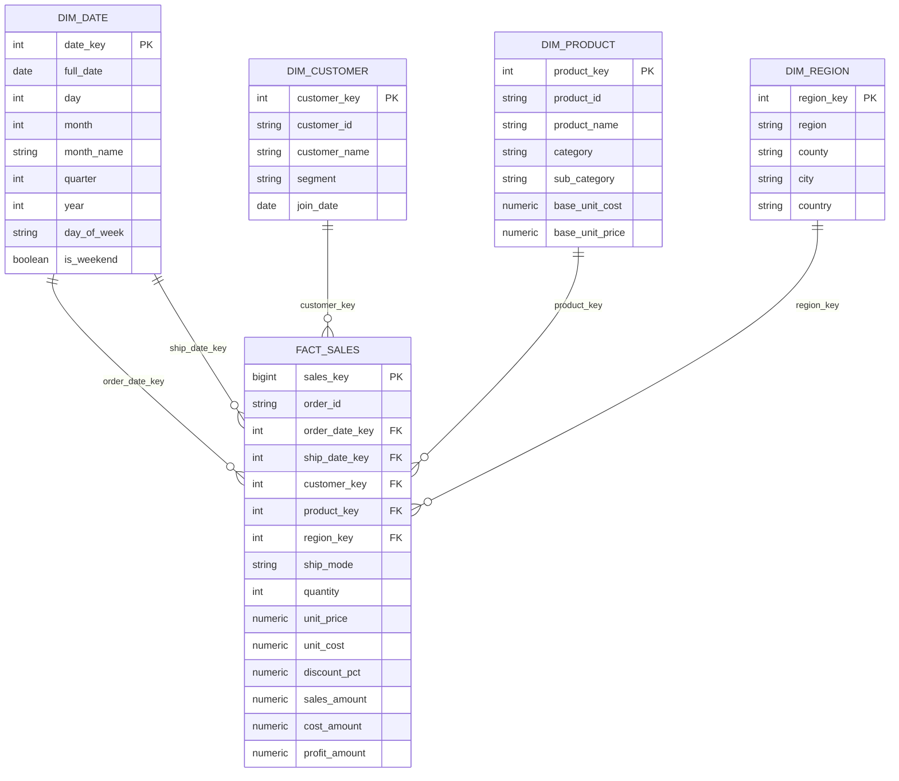

# Data Model
## Project: NorthPeak Retail - Profitability Decline Analysis

---

## 1. Design Approach: Star Schema

A star schema is used instead of a single flat table. This is a deliberate choice, not a default:

- **Query performance:** aggregations (SUM/GROUP BY across region, category, segment) are faster and more readable against a fact table joined to small dimensions than against one wide denormalized table.
- **Power BI best practice:** Power BI's DAX engine (VertiPaq) is optimized for star schemas — filters propagate cleanly from dimensions to the fact table via single-direction relationships.
- **Portfolio signal:** most tutorial-level BI projects use one flat CSV. Modeling a proper fact/dimension structure demonstrates data modeling competency, not just dashboard-building.

**Grain of the fact table:** one row = one product line item within one order (i.e., an order with 3 products produces 3 fact rows). This matches how the Sample Superstore-style datasets are structured and is the correct grain for product-level profitability analysis.

---

## 2. Entity-Relationship Diagram

---

## 3. Design Decisions & Rationale

| Decision | Rationale |
|---|---|
| **Role-playing dimension for dates** (`order_date_key` and `ship_date_key` both reference `dim_date`) | Avoids duplicating a second date table; standard technique for handling multiple date roles against one fact |
| **Surrogate integer keys** for all dimension PKs, with business keys (`customer_id`, `product_id`) retained as separate columns | Decouples the model from source-system IDs; supports future Slowly Changing Dimension handling without restructuring |
| **`unit_price`, `unit_cost`, `discount_pct` stored at the fact level**, not only in `dim_product` | Prices, costs, and discounts vary by transaction over time, storing only a "base" price in the dimension would make historical margin analysis inaccurate. `dim_product.base_unit_cost`/`base_unit_price` represent the product's reference values; actual transaction economics live in the fact. |
| **`sales_amount`, `cost_amount`, `profit_amount` stored as calculated columns in the fact table** (not computed only in DAX) | Ensures SQL and Python analysis (which query Postgres directly) get identical figures to Power BI, per the KPI Framework's "single formula rule" |
| **Type 1 (overwrite) dimension handling** — no SCD Type 2 history tracking | Appropriate for portfolio scope; documented here as a known simplification and named explicitly as a "Future Enhancement" (see Section 5) rather than silently omitted |
| **Foreign key constraints enforced** between fact and dimensions | Satisfies NFR-04 (referential integrity); also catches data generation bugs early (an orphaned fact row will fail to insert) |

---

## 4. Indexing Strategy

| Index | Purpose |
|---|---|
| Primary keys on all surrogate keys (`date_key`, `customer_key`, `product_key`, `region_key`, `sales_key`) | Enforced automatically via `PRIMARY KEY` |
| B-tree index on `fact_sales.order_date_key` | Most filters/aggregations are date-range based |
| B-tree index on `fact_sales.product_key`, `fact_sales.region_key`, `fact_sales.customer_key` | Supports fast joins/group-bys for the core analysis dimensions |
| Composite index on `fact_sales(order_date_key, product_key)` | Supports the most common query pattern: trend-by-product over time |

---

## 5. Known Limitations / Future Enhancements

- No SCD Type 2 tracking, if a customer's segment or a product's category changes over time, this model does not preserve history. Acceptable for a static synthetic dataset; would need to be addressed for a real production model.
- No separate `dim_ship_mode`, ship mode is kept as a fact-level attribute since it's low-cardinality and not a current analysis focus. Could be extracted to its own dimension if operational/logistics analysis becomes in-scope later.
- Single `dim_region` conflates region/county/city into one dimension rather than a geography hierarchy table, sufficient for this project's scope, but a larger implementation might separate geography into its own hierarchical dimension.
- Geography reflects Kenya's administrative structure: `region` uses the 8 former provinces (Nairobi, Central, Coast, Eastern, North Eastern, Nyanza, Rift Valley, Western) as a natural grouping level above the 47 counties; `county` holds the actual county name (e.g., "Uasin Gishu", "Mombasa").

---

## 6. Naming Convention

- Schema name: `northpeak`
- Tables: `snake_case`, prefixed by role (`dim_`, `fact_`)
- Surrogate keys: `<table>_key`
- Business/natural keys: `<entity>_id`
- All monetary columns: `numeric(12,2)`
- All percentage columns (e.g., `discount_pct`): `numeric(5,4)`, stored as a decimal fraction (0.20 = 20%), never as a whole number, to avoid ambiguity in downstream calculations
