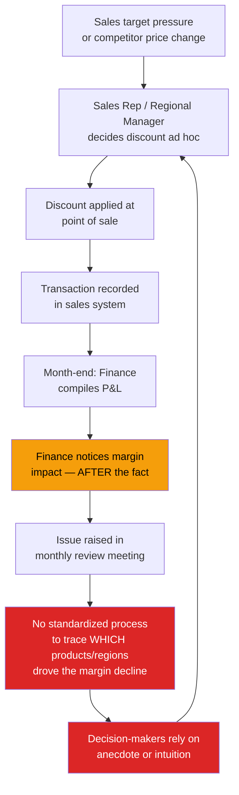
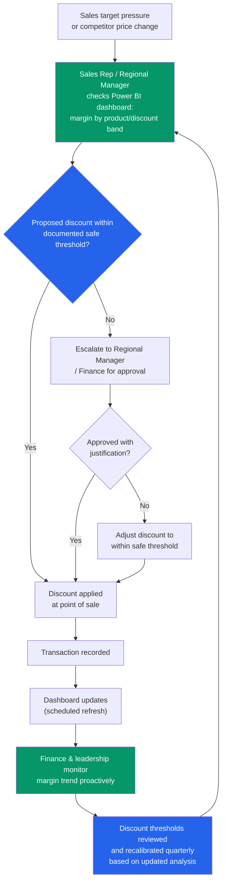

# Process Maps: Discounting & Pricing Decision Process
## Project: NorthPeak Retail - Profitability Decline Analysis

---

## 1. Why This Process

The core business problem centers on margin erosion, and discounting practice (BRD Objective 3) is one of the leading suspected drivers. This document maps how discount and pricing decisions are currently made (As-Is) versus how they should be made once this analytics solution is in place (To-Be). It illustrates not just *what data was analyzed*, but *what business process the analysis is meant to change*, the actual purpose of a BI solution.

---

## 2. As-Is Process: Discounting & Pricing Decisions (Current State)

### 2.1 Narrative

Today, discount decisions at NorthPeak are made independently by Regional Managers and Sales Representatives, largely reactively, in response to competitor pricing, customer negotiation pressure, or end-of-quarter sales targets. There is no centralized visibility into how discount levels affect profit margin by product or category. Finance only sees the profitability impact **after the fact**, during monthly P&L close, by which point the quarter's discounting pattern is already locked in. There is no feedback loop informing future discount decisions.

### 2.2 Diagram

### 2.3 Key Problems Identified in As-Is

| Problem | Business Consequence |
|---|---|
| Discount decisions made without profitability data at point of decision | Discounts routinely applied below the profit-safe threshold |
| No centralized, product/region-level margin visibility | Root causes of margin decline are invisible until quarter-close |
| Feedback loop is monthly and backward-looking | Corrective action always lags the problem by weeks |
| No standardized discount governance/thresholds | Inconsistent discounting across regions and reps |
| Reliance on anecdote in review meetings | Decisions not repeatable, not data-driven, hard to audit |

---

## 3. To-Be Process: Discounting & Pricing Decisions (Future State)

### 3.1 Narrative

With the profitability dashboard in place, discount and pricing decisions are informed by near-real-time, product, and region-level margin visibility. Regional Managers and Sales Reps can check margin impact *before* finalizing a discount, using documented discount-threshold guidance derived from the analysis (FR-09). Finance shifts from a reactive, month-end detection role to a proactive monitoring and governance role, using the same dashboard.

### 3.2 Diagram

### 3.3 Key Improvements in To-Be

| As-Is Problem | To-Be Solution | Enabled By |
|---|---|---|
| No profitability data at decision point | Dashboard checked before discount is finalized | Power BI Discount Analysis page (FR-15) |
| Root causes invisible until month-end | Near-real-time product/region margin visibility | Scheduled dashboard refresh (NFR-08) |
| No discount governance | Documented, threshold-based approval workflow | Discount threshold findings (FR-09) |
| Backward-looking feedback loop | Proactive monitoring + quarterly threshold recalibration | KPI Framework + recurring review cadence |
| Anecdote-driven decisions | Data-driven, auditable, repeatable decisions | SQL/Python analysis + dashboard as single source of truth |

---

## 4. Process Maturity Shift Summary

| Dimension | As-Is | To-Be |
|---|---|---|
| **Decision timing** | Reactive (post-transaction) | Proactive (pre-transaction) |
| **Data visibility** | Fragmented, month-end only | Centralized, near-real-time |
| **Governance** | None / informal | Threshold-based approval workflow |
| **Root-cause traceability** | Anecdotal | Data-traceable to product/region/discount band |
| **Review cadence** | Monthly, after the fact | Continuous monitoring + quarterly recalibration |

---

## 5. Note on Scope

This process redesign is a **recommendation**, not a system this project implements (no workflow/approval tooling is being built — see BRD Section 7.2, Out of Scope). Its purpose is to demonstrate that the analytics deliverable is tied to a concrete operational change, not just descriptive reporting, a distinction reviewers use to separate analysts who understand "so what happens next" from those who only build dashboards.
