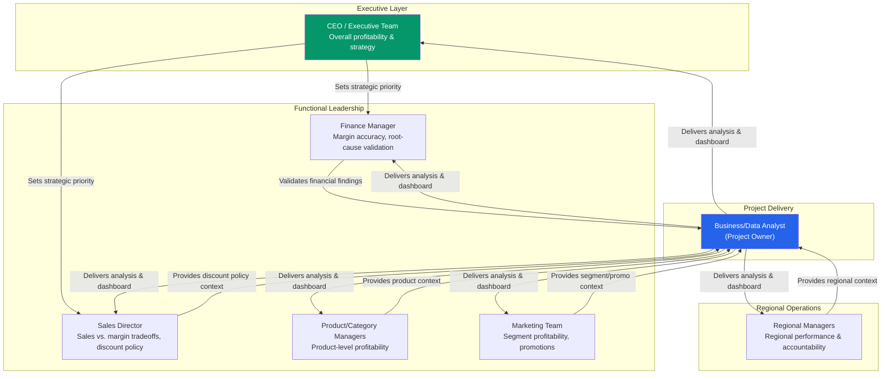

# Stakeholder Map
## Project: NorthPeak Retail - Profitability Decline Analysis

---

## 1. Stakeholder Landscape (Visual)

---

## 2. RACI Matrix

Defines who is **R**esponsible, **A**ccountable, **C**onsulted, and **I**nformed at each stage of the project.

| Activity | CEO | Finance Manager | Sales Director | Regional Managers | Product/Category Managers | Marketing Team | Business/Data Analyst |
|---|---|---|---|---|---|---|---|
| Define business problem & objectives | A | C | C | I | I | I | R |
| Approve BRD & scope | A | C | C | I | I | I | R |
| Provide domain/business context | I | C | C | C | C | C | R |
| Data modeling & data generation | I | I | I | I | I | I | R/A |
| SQL & Python analysis | I | I | I | I | I | I | R/A |
| Validate financial figures & margin logic | I | R/A | C | I | C | I | C |
| Review discount policy findings | I | C | R/A | I | C | C | C |
| Review regional performance findings | I | C | C | R/A | I | I | C |
| Review product/category findings | I | C | C | I | R/A | I | C |
| Review segment/promotional findings | I | I | C | I | C | R/A | C |
| Power BI dashboard development | I | I | I | I | I | I | R/A |
| Executive summary & recommendations | A | C | C | C | C | C | R |
| Final sign-off | A | I | I | I | I | I | I |

**Legend:** R = Responsible (does the work) · A = Accountable (owns the outcome) · C = Consulted (input sought) · I = Informed (kept updated)

---

## 3. Stakeholder Interest & Influence Summary

| Stakeholder | Interest Level | Influence Level | Engagement Approach |
|---|---|---|---|
| CEO / Executive Team | High | High | Executive summary, high-level dashboard view; focus on bottom-line impact |
| Finance Manager | High | High | Detailed margin methodology review; must validate profit/cost logic before recommendations are trusted |
| Sales Director | High | Medium-High | Discount analysis review; frame findings as sales-enablement, not sales-blame |
| Regional Managers | Medium-High | Medium | Regional drill-down dashboard pages; benchmark comparisons across regions |
| Product/Category Managers | High | Medium | Product-level profitability breakdown; loss-making SKU/category detail |
| Marketing Team | Medium | Low-Medium | Segment and promotional discount effectiveness views |
| Business/Data Analyst | High | High (delivery) | Owns end-to-end execution and communication of findings |

---

## 4. Notes on Real-World Application

In an actual engagement, this stakeholder map would be validated through interviews or a requirements workshop before finalizing the BRD. For this portfolio project, stakeholder needs are inferred from realistic organizational roles and standard retail-analytics concerns, and are used to justify why the KPI Framework and dashboard structure are built the way they are (e.g., the Finance Manager's need for margin validation is why the SQL/Python analysis must reconcile exactly with Power BI DAX calculations).
